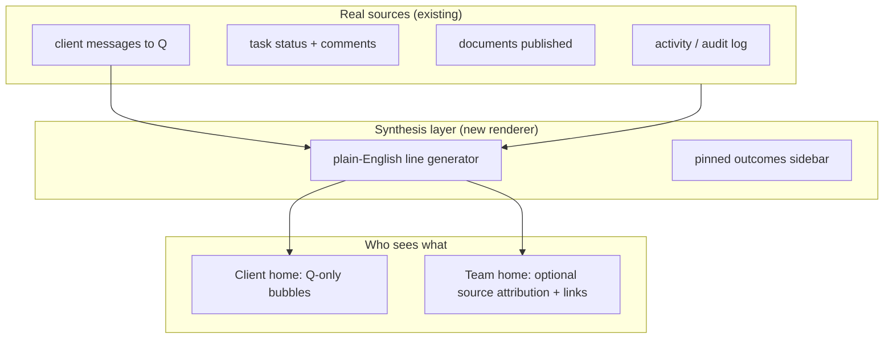
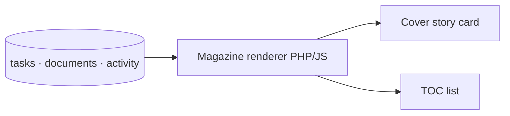
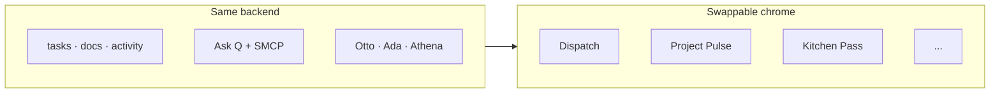

# Tasks 2.0 — Creative pitch deck

**Ideation only · no build · v2 · 2026-06-26**  
**Project:** [Sanctum Tasks — platform upgrade](https://tasks.decisionsciencecorp.com/admin/project.php?id=10)  
**Tracker:** [Task #1314](https://tasks.decisionsciencecorp.com/admin/view.php?id=1314)

---

## What this is

Nine **wildly different** concepts for the **new default project home** — plus onboarding. Same backend. Same roles for everyone. **Only the interface changes** based on preference (easy mode / walkthrough / standard).

**Not a portal to Mark.** This is a **coordination tool** for a staffed team:

| Who | Role in the system |
|-----|-------------------|
| **Otto** | Dev — ships features, docs, fixes |
| **Ada** | Infra — deploy, DNS, boxes |
| **Athena** | Companion — context, alignment, human touch |
| **Q** | In-app coordinator — routes requests, reads the board |
| **Humans (Alex, Brooke, Mark, Jim…)** | Same permissions model today — **different chrome** |

The product shows **work in motion**, not a maze of PM chrome.

---

## Locked decisions (from Mark — not up for re-litigation)

1. **Coordination, not Mark-as-wizard** — surface the *team* doing work (Otto/Ada/Athena/Q), not "message Mark."
2. **Same roles for everyone** — easy mode is a **view preference**, not a permission tier.
3. **Onboarding is optional** — login prompt: *"New to project tools? Want a walkthrough? Or easy mode?"*
4. **This replaces current project home** — Lists/Schedule/Docs/Doors/Activity stay on other tabs; home is new.
5. **Creative phase** — pitch many ideas; pick later.

---

## Why we're here (60 seconds)

**Basecamp research said:** projects, clients, dock tools, transparency, home-as-triage.  
**We shipped:** the data layer + tabbed project workspace.  
**We did not ship:** Hey! stream, message board, pins UI, check-ins, omnibar — and the **UX audit** items that make non-PMs bounce (#339, #704).

**Alex's Ask Q usage (2 messages):** he doesn't ask about statuses. He says *"deliver this to the team"* and *"assign review."* He hit read-only ACL. The **modality is coordination** — file handoff, request, wait for ping.

---

## Mark's reactions (v2 — 2026-06-26)

| # | Concept | Mark's take | Otto response |
|---|---------|-------------|---------------|
| 1 | Dispatch Board | Wants **more versions** | +2 variants below (Mission Briefing, Flight Board) — PM language, not devops |
| 2 | Living Room | Right idea, **too hyper-specialized** (felt devops not PM) | Reframed as **Project Pulse** — milestones/deliverables, not "two ops items" |
| 3 | Kitchen Pass | Wants **more versions** | +2 variants (Hotel Desk, Kanban pass-through) |
| 4 | Conversation First | **Good bones**, too chat-focused | → **Emissary Feed** — simulated narrative from activity; Q speaks *for* the team |
| 5 | Now Playing | **Loves the colors**; not substantively new | Parked as **optional dark theme** — not a competing home concept |
| 6 | Magazine Cover | Interesting; feels like different system | **Entity mapping** section below — same DB, editorial renderer |
| 7 | Laundromat | Cool but probably doesn't work | **Convince-or-kill** essay below — recommend kill as home, keep as micro-motion |
| 8 | One Compass | Too radical; doesn't get it | **Convince-or-kill** essay below — not default home; **easy-mode skin** |
| 9 | Onboarding | **Table stakes** | Required for any winner — not in the concept horse race |

---

## Table stakes — onboarding (Concept 9)

**Not a competing project home.** Every chosen direction ships this on first login (skippable):

*"New to project tools? · Walk me through · Easy mode · I know my way around"*

Same roles, same data — **chrome preference only**. Change anytime in settings.

---

## Concept gallery — pick your poison

Each concept has an **illustration** (verified against pitch intent). All replace `project.php` default tab. Power users: link **"See everything"** → today's tabs.

---

### Concept 1 — Dispatch Board

**Metaphor:** Air traffic / newsroom — who's on what right now.

**One-liner:** Your project is a live desk; Otto, Ada, Athena show status cards; you add a request.

| Pros | Cons |
|------|------|
| Makes Sanctum agents **visible** — matches how we actually work | Could feel "character-y" if avatars are too cute |
| Plain-English week strip | Needs copy discipline so cards don't become task IDs |
| Big "tell the team" CTA | Team members might find it redundant with Activity |

**Best for:** Clients who want **visibility without learning PM**.

**Variants (v2):**

| Variant | Idea | Mock |
|---------|------|------|
| **1A** (original) | Agent status cards + week strip | [784](https://tasks.decisionsciencecorp.com/api/get-asset.php?id=784) |
| **1B — Mission Briefing** | Workstreams by deliverable type (copy, site, alignment) — plain English, no deploy jargon |  |
| **1C — Flight Board** | Departure-board rows: deliverable · owner · status · ETA |  |

**PM correction:** v1 skewed "who's deploying what." v2 variants frame **deliverables and milestones** — the language Alex/Brooke actually use on calls.

---

### Concept 2 — Project Pulse *(was Living Room)*

**Metaphor:** What's on your desk this week — not a coffee table of ops tickets.

**One-liner:** Three buckets: **Needs your input** · **In progress** · **Recently finished**. Everything else is tracked but not shown until relevant.

| Pros | Cons |
|------|------|
| **PM-native** — milestones, reviews, approvals | Still requires backend prioritization |
| Low intimidation without hiding the team | "Recently finished" can get long |
| Scales better than "two items max" | Power users want more density |

**Best for:** Alex-class users who want **coordination without PM vocabulary**.

**Variants (v2):**

| Variant | Idea | Mock |
|---------|------|------|
| **2A** (original Living Room) | Two items max — reference only; felt too ops-specific | [785](https://tasks.decisionsciencecorp.com/api/get-asset.php?id=785) |
| **2B — Project Pulse** | Three PM sections, multiple in-progress rows with owner names |  |
| **2C — Priority Stack** | One hero "your turn" card + compact "team is working on" stack |  |

**Why rename:** "Living Room" implied domestic minimalism tied to *our* internal agent lanes. **Project Pulse** is the same restraint with **client-facing deliverable language**.

---

### Concept 3 — Kitchen Pass

**Metaphor:** Restaurant ticket rail — orders in, plates out.

**One-liner:** Each request is a ticket clipped to the rail; shows which agent has it and if it's ready for you.

| Pros | Cons |
|------|------|
| **Request lifecycle** is obvious | Metaphor may skew whimsical |
| "Ready for you" is a clear client action | Less good for long-running vague work |
| Maps cleanly to task rows underneath | Visual busy if >5 tickets |

**Best for:** Handoff-heavy clients (files, approvals, questions).

**Variants (v2):**

| Variant | Idea | Mock |
|---------|------|------|
| **3A** (original) | Restaurant ticket rail | [786](https://tasks.decisionsciencecorp.com/api/get-asset.php?id=786) |
| **3B — Hotel Desk** | Concierge tickets — same lifecycle, less kitchen whimsy |  |
| **3C — Kanban Pass** | Requested → In progress → Ready for you → Done swimlanes |  |

**Note:** 3C is the most legible to anyone who's seen Trello once; 3B keeps personality without the restaurant metaphor.

---

### Concept 4 — Emissary Feed *(evolved from Conversation First)*

**Metaphor:** The project **talks to you** — but it's a **narrated digest**, not a group chat.

**One-liner:** A feed that *looks* like conversation, synthesized from real activity. **Q is the only voice** facing clients. Team members may see source threads on other tabs.

| Pros | Cons |
|------|------|
| Familiar scroll pattern without Slack chaos | Must never feel fake — every line links to real events |
| Q already routes; this is Q **reporting back** | Summarization quality is the product |
| Matches Alex's "tell the team" modality | Team members may want direct @mentions in standard mode |

**Best for:** Clients who think in **updates and requests**, not boards.

#### v1 problem (Mark was right)

Original **Conversation First** showed Q + Otto + Ada + Athena as parallel chat participants. That implies:

- Clients can **interrupt** agents mid-work
- Multiple voices = **coordination noise** (who owns the reply?)
- Another chat app next to Telegram, email, Q widget

We already have Ask Q for **input**. The home tab should be **output** — what happened while you were away.

#### Emissary model (how it works)

| Event (backend) | Emissary line (client sees) |
|-----------------|----------------------------|
| Task #412 → `doing`, assignee Otto | *"Otto started work on the playbook draft."* |
| Doc #343 published | *"New: Hero page copy is ready for you to read."* [Open] |
| Task blocked on `waiting_client` | *"We're waiting on your Shopify admin access to continue."* |
| Alex message via Q | *"You asked about launch timing — the team is aligning on that."* |
| Ada deploy complete (activity) | *"Site updates went live this afternoon."* (no "deployed to multihost") |

**Rules:**

1. **Clients never DM agents** on the home feed — they type at the bottom into **Ask Q** (same as today).
2. **Every bubble is attributable** — tap expands to task/doc/activity row (trust).
3. **Team members** (Mark, Jim, DSC staff) can toggle **"Show sources"** — same feed with grey attribution chips, or jump to Activity tab.
4. **Not LLM fanfic** — template + field extraction first; Q polishes only when confidence is high.

#### Otto × Athena foil (design dialogue)

*Athena (companion lens) — queued on moya Broca 2026-06-26; Otto synthesis below until outbox lands:*

> **Otto:** Clients shouldn't feel they're in our war room. Q as emissary means Alex gets *"your review is ready"* not a dump of Otto↔Ada thread.
>
> **Athena:** The anxiety reducer isn't chat — it's **being seen**. A narrated feed says "someone is on this" without making Alex pick a lane. Patronizing only if the voice lectures; fine if it's short and factual.
>
> **Otto:** So simulated conversation is really **activity stream with a face**.
>
> **Athena:** Yes. One face. Q. The team stays backstage unless the client opens Docs or Ask Q asks for a human.

#### Hybrid potential

**Emissary Feed + Project Pulse (2B):** feed on top, three buckets below.  
**Emissary + Kitchen Pass:** each narrated line can expand to a ticket card.

**Original mock (retired direction):** [787](https://tasks.decisionsciencecorp.com/api/get-asset.php?id=787) — multi-agent chat layout.

---

### Concept 5 — Now Playing → **Theme reference only**

**Mark:** Loves the **colors** (dark + red accent). Not substantively different from current tabbed home.

**Disposition:** Extract palette for an optional **"Broadcast" theme** — hero emphasis, one LIVE card — but **do not compete** as a primary home concept. Could skin Dispatch or Emissary hero regions.

| Keep | Drop |
|------|------|
| Dark bg `#1a1a1f`, accent red, LIVE badge typography | TV-guide grid, channel metaphor, schedule rows |

---

### Concept 6 — Magazine Cover

**Metaphor:** Weekly editorial — one cover story, tiny TOC for the rest.

**One-liner:** Project updates feel like an issue, not a backlog.

| Pros | Cons |
|------|------|
| **Beautiful**, shareable | Less actionable — more "read" than "do" |
| Otto/Ada bylines = coordination | Needs art direction per project |
| Hides complexity in TOC lines | May age poorly if not updated |

**Best for:** Client-facing **prestige** projects (PSF, Hit Harder).

#### How Magazine maps to what we already have

Mark asked: *feels like a different system — how does it connect?*

It's **not** a new datastore. It's a **cadence + layout renderer** on existing entities:

| Magazine UI | Tasks entity | Rule |
|-------------|--------------|------|
| **Cover story** (hero) | Highest-priority `doing` task or newest `documents` row flagged `cover` | Auto-pick: client-blocked item, else latest published doc, else #1 ranked `doing` |
| **Byline** ("Otto · 2 days ago") | `assigned_to_user_id` + `updated_at` | Map Otto/Ada/Athena service users; humans show display name |
| **TOC lines** (small) | Top 5 tasks by `rank` + open milestones | Plain titles only — no list_id in copy |
| **"Inside this issue"** | `documents` in project directory | Links to `doc.php` |
| **Issue date** | Rolling 7-day window or manual `project_meta.issue_week` | Default: Monday–Sunday rollup |
| **Archive / back issues** | Closed `done` tasks + docs grouped by week | Read-only; same as Activity filtered |

**What's actually new:** (1) weekly grouping job or query, (2) cover-story selection heuristic, (3) editorial typography CSS. **Q + Ask Q unchanged.**

**Risk:** beautiful but passive — pair with a **"Your turn"** chip (from Project Pulse) so it's not read-only wallpaper.

---

### Concept 7 — Laundromat — **convince or kill**

**The case for:** Parallel async work is genuinely hard to show. Washing machines = intuitive **running / done / waiting** without reading a board. "Ready for pickup" is a great client phrase.

**The case against (stronger):**

| Failure mode | Why it kills as home |
|--------------|---------------------|
| **Mapping arbitrariness** | Which task is "Dryer 3"? User has to learn the map every visit |
| **Waiting-on-client** | Machines don't model "paused for your input" — breaks metaphor |
| **B2B tone** | PSF clients may read it as toy, not partner |
| **We already solve parallel** | Dispatch 1B/C and Kitchen Pass 3C show parallel work without gimmick |

**Verdict: KILL as default home.** Keep **one idea**: subtle "running" animation on in-progress cards in Dispatch/Pulse — personality without owning the whole metaphor.

---

### Concept 8 — One Compass — **convince or kill**

**Mark:** Too radical — doesn't get it.

**What it actually is:** Not "empty UI." It's **forced triage** — the system picks the single most important sentence for *you* right now, same way a hotel concierge answers "what should I do?" with one thing, not the floor plan.

**The case for:**

- **Cognitive load** — Alex doesn't want three sections; he wants *"approve the playbook"* full stop
- **Cheap to ship** — one query: client-blocked tasks → else assigned review → else latest team update
- **Pairs with any concept** — Easy mode = Compass sentence **above** Dispatch/Pulse/Emissary

**The case against:**

- **Mark/Jim need parallel truth** — hiding Otto's work while Ada's also moving feels like lying
- **One-liner quality** — bad copy = useless screen
- **No team visibility** — contradicts "coordination tool" unless you expand on tap

**Verdict: KEEP as Easy Mode skin, KILL as default home.** Onboarding path *"Easy mode"* → Compass one-liner + Ask Q + See everything. Standard mode → pick 1/2/3/4/6.

**Try it:** Open PSF as Alex with Easy mode — one sentence, one button. Mark opens same project in Standard — full Dispatch. **Same roles. Same data.**

---

## Bonus pitches (no illustration yet — text only)

### Weather Report
*"Sunny — on track. One cloud: Shopify install waiting on you."* Single metaphorical forecast per project. No tasks visible.

### Receipt strip
Every interaction prints a **receipt** you can scroll — timestamped plain English. Nerdy but legible. Like bank notifications for work.

### Playlist
Project = album. Tracks = workstreams. **Now playing** dot on one track. Play/pause = pause project (archived vibe).

### Front desk bell
One bell icon. Ring = new request modal. Wall behind desk shows agent status whiteboard (chalk style).

### Quest log (light)
Objectives in RPG language **without** game UI — *"Objective: Get playbook reviewed"* — for users who grew up on games but hate Jira.

### Orchestra score
Who has the melody (primary workstream), who's harmony (supporting). Sheet music aesthetic — niche but distinctive.

---

## Comparison matrix

| Concept | Intimidation ↓ | Sanctum agents visible | Handoff-friendly | Fun / memorable | Build weirdness | v2 status |
|---------|----------------|------------------------|------------------|---------------|-----------------|-----------|
| Dispatch Board | ●●●○ | ●●●● | ●●●○ | ●●○○ | Low | **Active** (+2 variants) |
| Project Pulse | ●●●● | ●●○○ | ●●●○ | ●●○○ | Low | **Active** (replaces Living Room) |
| Kitchen Pass | ●●●○ | ●●●○ | ●●●● | ●●●○ | Medium | **Active** (+2 variants) |
| Emissary Feed | ●●●● | ●●○○ (Q face) | ●●●● | ●●○○ | Medium | **Active** (evolved #4) |
| Now Playing | — | — | — | ●●●● palette | — | **Theme only** |
| Magazine Cover | ●●●● | ●●○○ | ●○○○ | ●●●○ | Medium | **Active** (mapping clarified) |
| Laundromat | ●●●○ | ●●●● | ●●●○ | ●●●● | Medium | **Killed** (micro-motion only) |
| One Compass | ●●●● | ●○○○ | ●●○○ | ●○○○ | **Lowest** | **Easy mode only** |

---

## Hybrid ideas (mixing is allowed)

| Mashup | What |
|--------|------|
| **Project Pulse + Dispatch** | Pulse buckets; agent/workstream row above |
| **Emissary + Pulse** | Q narrates updates; sticky "your turn" card |
| **Kitchen Pass + Emissary** | Narrated line expands to ticket card |
| **Magazine + Pulse** | Cover story + "Needs your input" chip |
| **One Compass + any** | Easy mode = one-liner; Standard = chosen home |
| **Now Playing theme + Dispatch** | Dark skin, LIVE badge on primary workstream |

---

## What all concepts share (non-negotiables)

- **No task IDs** in default client copy
- **"See everything"** escape hatch → current tabs
- **Requests** create real tasks/docs — chrome is not fake
- **Q** stays the universal input layer

---

## Basecamp gaps this unlocks (without cloning BC)

| BC never shipped | Which concepts address it |
|------------------|---------------------------|
| Hey! stream | Dispatch, Emissary, Project Pulse |
| Message board | Emissary Feed, Magazine |
| Campfire | Emissary Feed, Q bubble |
| Pinned projects | Dispatch week strip, Magazine TOC |
| Check-ins | Onboarding + optional weekly ping (any) |
| Omnibar | Q + "Add request" (all) |

---

## References

| Artifact | Link |
|----------|------|
| Domain plan | `docs/BASECAMP3_DOMAIN_PLAN.md` |
| UX audit | `docs/ux-audit-2026-05-04.md` |
| BC gap table | `docs/BASECAMP3_UX_OVERLAY_PLAN.md` |
| Modality omnibus | [Doc #299](https://tasks.decisionsciencecorp.com/admin/doc.php?id=299) |
| Illustrations task | [Task #1314](https://tasks.decisionsciencecorp.com/admin/view.php?id=1314) |

---

## Next step (still ideation)

**Short list after v2:** Dispatch (1B/1C) · Project Pulse (2B/2C) · Kitchen Pass (3B/3C) · **Emissary Feed** · Magazine (with mapping). Onboarding + Easy-mode Compass are **table stakes**.

Mark picks 2–3 for **HTML interactive mocks** — not prod.

*Otto · v2 pitch · Mark reactions incorporated · attachments #793–799 on [Task #1314](https://tasks.decisionsciencecorp.com/admin/view.php?id=1314)*
