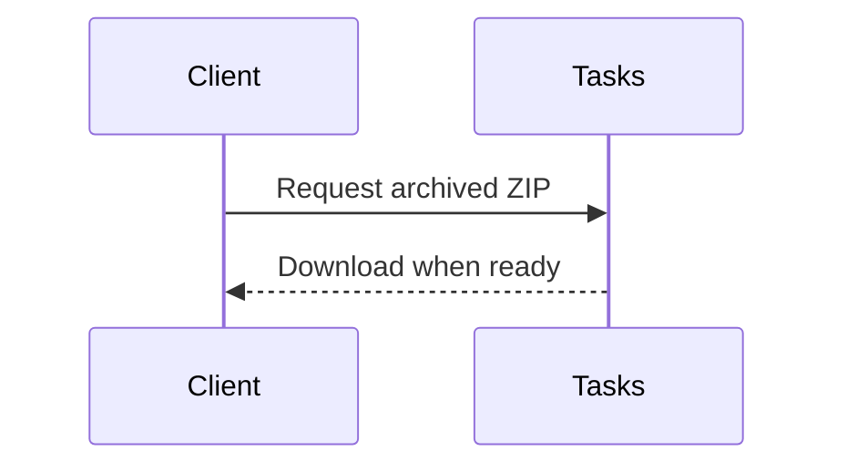

# Docs and files

Tasks are for work. Documents are for the knowledge around the work. Files are proof, source material, or payload. Treat them differently and the system stays sane.

## Documents: the long shelf

Project **Docs** are markdown documents scoped to a project.

Use documents for:

- Specs.
- Research.
- Client-facing explanations.
- Meeting notes that need a stable home.
- Roadmaps.
- Handoffs.
- Anything too long to live cleanly in a task body.

A task should answer "what needs doing?" A document can answer "why are we doing it this way, what did we learn, and what should the next person know before touching it?"

## Documents are not task comments

A comment is part of a task thread. A document is a reference.

If the note changes the status of a task, comment on the task. If the note explains a whole project, write a document. If both are true, write the document and link it from the task comment with one sentence explaining why it matters.

## Document folders

Docs can live in directory paths inside a project. Use folders when they make retrieval easier, not because every document needs a taxonomy.

Good folder names are plain:

- `Specs`
- `Research`
- `Client notes`
- `Transcripts`
- `Launch`
- `Operations`

Bad folder names are internal riddles. If a client, builder, or future agent has to decode the folder name, it failed.

## Public document links

Some project documents can be shared as public read-only links when a permitted editor enables that option.

Use public links for documents that are meant to be read outside the logged-in app: a client brief, an explainer, a status report, or a standalone handoff.

Do not use public links for secrets, private task threads, credentials, internal backchannel notes, or anything that should require membership.

Comments stay private. Public document links are for the document body.

## Files, images, and inline proof

Task attachments can be:

- Uploaded files stored by Tasks.
- Remote URLs registered against a task.

Uploaded images can be embedded directly in task bodies and comments. The UI gives you markdown snippets for that. Use them.

Screenshots are not decoration. They answer the question, "What did the user actually see?" If a task ships a visual change, attach the proof where the stakeholders will look: on the task.

## How images are served

Tasks does not treat uploaded task images as public hotlinks.

The canonical image URL is:

`/api/get-asset.php?id=...`

That endpoint checks whether the viewer can see the task. If they cannot see the task, they should not be able to fetch the image.

This is why you should not hand-build `/uploads/...` URLs. The file may exist there, but the permission boundary lives at `get-asset.php`.

## Inline markdown images

Use markdown image syntax when you want the file to show in the body:

```md

```

The short description should say what the image is, not "image." Good examples:

- ``
- ``
- ``

## Attachments in archived board ZIPs

When you generate a board archive ZIP, Tasks tries to carry the evidence with the board.

The export includes:

- Board index HTML.
- Task HTML pages.
- Document HTML pages.
- Local attachment files under `assets/`.
- Rewritten image links when the source was a Tasks asset.
- Note files for attachments that could not be copied.

That is the point of the archive: the board should be browsable after the live project is no longer active.

## Markdown and Mermaid

Documents, task bodies, and comments support safe markdown.

Use Mermaid blocks for diagrams:

````

````

Use diagrams when they reduce ambiguity. Do not make a diagram do the work of a clear sentence.
